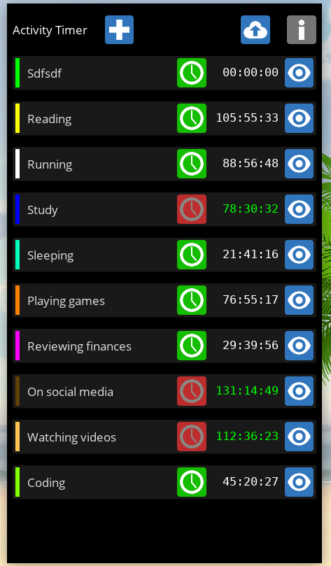
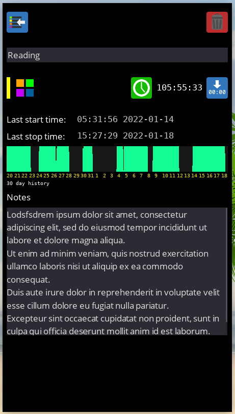

# Activity Timer Created with the Godot Engine

This will be a mobile App.

Click a plus button to create a new timer.

The time increments will be in minutes with the stop time rounded to the nearest minute by default.

The timer is given a name by the user.

The timers may be listed with a summary of their current time counts and status of running, or stopped.

Instead of a reset function: have an edit function. It should not be easy to accidentally reset a timer. And editing allows for adjustment of the time value in case of say forgetting it was left running.

When tapping on a timer in the list, open a scene with large *start* and *stop* buttons and a large *time* display. This avoids fumbling mistakes tapping on the small list items.

Have a bar graph stats display. Project the bars horizontally so that the names may easily be superimposed on them.

Produce stats that may be useful to show trends of motivation etc.
